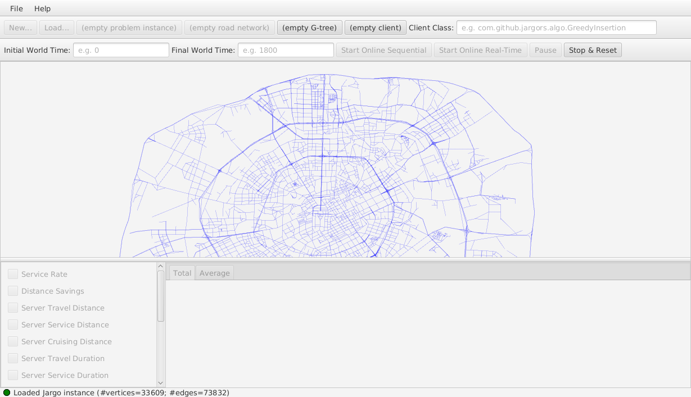

# Jargo

Created July 2, 2019 | Latest Version 1.0.0 (Nov. 11, 2019) (in-development)
-------------------- | -----------------------------------------------------

This directory contains the source code for the Jargo program and
documentation. Both the program codes and the LaTeX codes are compiled from
noweb files, `src/*.nw` using the noweb commands `notangle` and `noweave`.  See
the `Makefile` for details.

For those without notangle and noweave, the "woven" `doc/*.tex` and "tangled"
`java/*.java` codes are provided.

### BUILD PREREQUISITES
*(versions not shown here are unsupported)*

Building requires the GNU Make 4.2.1 program and several prerequisites.

Prerequisites for building the jar (`jargors-1.0.0.jar`):

- Java(TM) SE Runtime Environment 18.9 (build 11.0.1+13-LTS)
- JavaFX 13+14
- javac 11.0.1
- jar 11.0.1
- Apache DBCP2 library (`commons-dbcp2-2.7.0.jar`)
- Apache Logging library (`commons-logging-1.2.jar`)
- Apache Pool2 library (`commons-pool2-2.7.0.jar`)
- `jargors-Exceptions-1.0.0.jar`
- `jargors-GTreeJNI-1.0.0.jar`

Prerequisites for building the java codes (`java/*.java`):

- notangle 2.12

Prerequisites for building the tex codes (`doc/*.tex`):

- noweave 2.12

Prerequisites for building the pdf (`jargo.pdf`):

- pdflatex 3.14159265-2.6-1.40.19, included in TeX Live 2018
- texfot 1.37, included in TeX Live 2018

### BUILD INSTRUCTIONS
*(tested on Fedora 27)*

To build the jar (`jargors-1.0.0.jar`):

- Verify `echo $CLASSPATH` returns a directory that contains
  `jargors-GTreeJNI-1.0.0.jar`, `jargors-Exceptions-1.0.0.jar`
- Verify `echo $CLASSPATH` returns a directory that contains
  `commons-dbcp2-2.7.0.jar`, `commons-logging-1.2.jar`, `commons-pool2-2.7.0.jar`
- Verify `echo $CLASSPATH` returns a directory that contains
  JavaFX libraries `javafx.base.jar`, `javafx.controls.jar`, etc.
- Verify `javac`, `jar` programs are accessible from command line
- Type `make jar`

To build the java codes (`java/*.java`):

- Verify `notangle` program is accessible from command line
- Type `make java`

To build the pdf (`jargo.pdf`):

- Verify `pdflatex` and `texfot` programs are accessible from command line
- Type `make pdf`

To build the tex codes (`doc/*.tex`):

- Verify `noweave` program is accessible from command line
- Type `make tex`

To build all the above using one command:

- Type `make all` or simply `make`

To delete build objects from the directory:

- Type `make clean`

To delete the java and tex codes in addition to the build objects:

- Type `make purge`

### LAUNCHING THE GUI

The graphical Jargo Desktop can be started using `gui-launcher.sh`.

Prerequisites for running Desktop:

- JavaFX 13+14
- Apache Derby 10.15.1.3
- Apache DBCP2 library (`commons-dbcp2-2.7.0.jar`)
- Apache Logging library (`commons-logging-1.2.jar`)
- Apache Pool2 library (`commons-pool2-2.7.0.jar`)
- `jargors-1.0.0.jar`
- `jargors-Exceptions-1.0.0.jar`
- `jargors-GTreeJNI-1.0.0.jar`
- `libgtree.so`

To start Desktop:

- Verify directory `jar` contains `jargors-1.0.0.jar`.
- Verify `echo $LD_LIBRARY_PATH` returns a directory that contains `libgtree.so`.
- Verify `echo $DERBYPATH` returns a directory that contains `derby.jar`.
- Verify `echo $CLASSPATH` returns a directory that contains
  `jargors-GTreeJNI-1.0.0.jar`, `jargors-Exceptions-1.0.0.jar`
- Verify `echo $CLASSPATH` returns a directory that contains
  `commons-dbcp2-2.7.0.jar`, `commons-logging-1.2.jar`, `commons-pool2-2.7.0.jar`
- Verify `echo $CLASSPATH` returns a directory that contains
  JavaFX libraries `javafx.base.jar`, `javafx.controls.jar`, etc.
- Type `./gui-launcher.sh`

